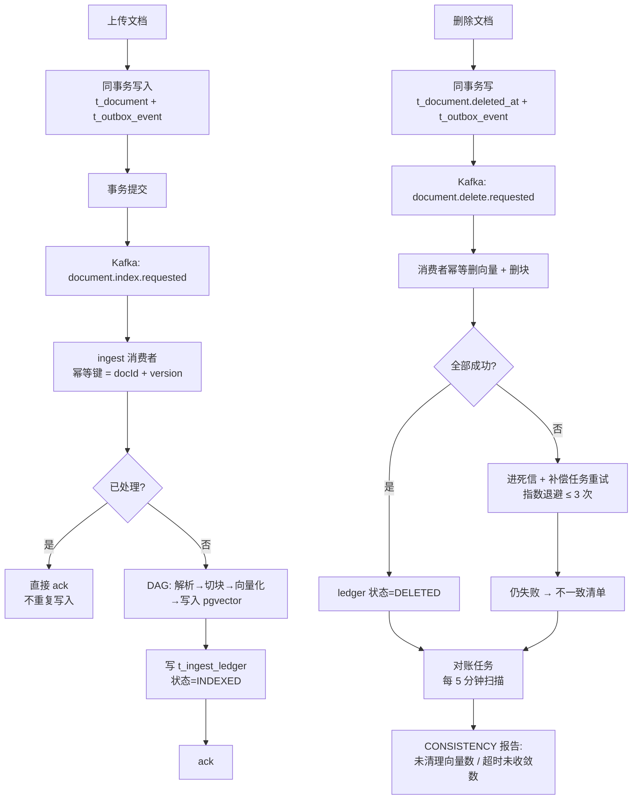
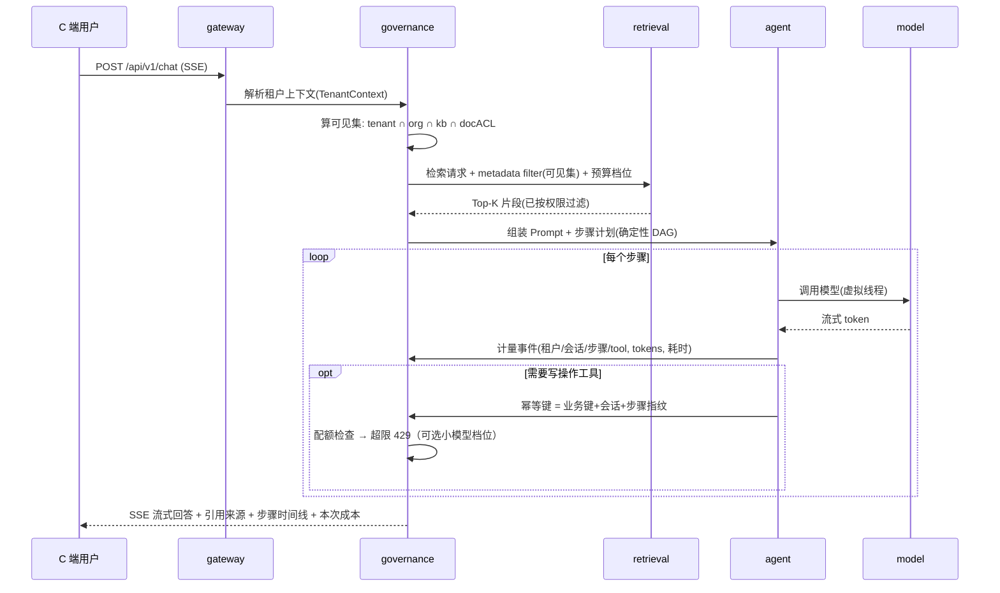
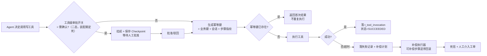

# AIWarden PRD — 多租户 AI 数据与用量治理层

| 项 | 内容 |
|---|---|
| **文档版本** | v2.2（v2.1 + **2026-10-10 回写 M3 交付期状态**：24 条评测门禁结论（§5.9/§8/§12）与 `aiwarden-web` 前端落地后的 §6 工程结构、§8 M3 验收；M3 编排与评测口径见 [ADR-012](adr/ADR-012-chat-orchestration-and-eval.md)。v2.1 含：立项版 v1.0 + 2026-10-06 回写 13 条裁决，依据 [06-PRD修订裁决清单](research/06-PRD修订裁决清单.md)；2026-10-07 按 [ADR-007](adr/ADR-007-visibility-pushdown.md) 同步 §9 数据模型与 §11 风险 8；**2026-10-07 回写 M2 交付期裁决 14–18**——含 §5/§6/§8/§9/§12 的口径对齐；**2026-10-07 追加裁决 19**（P4b 砍除 / 用量看板自绘，§3/§5.6/§8/§10/§12 同步）；**2026-10-07 追加裁决 20**（M3 编排与评测口径：Mock 替身 + 真实治理管道，§7.4/§9 同步）） |
| **文档状态** | **需求规划已定稿；M0 / M1 / M2 已落地（MVP 达成：P1 / P2 / P3 / P4a 成立）**——多模块骨架、租户上下文四类边界、Flyway V1–V9、Outbox → Kafka → 幂等消费 → 对账 + 计量主链路、可见集四级下推 + 越权样本门禁、工具副作用治理（幂等/补偿/二态审批）、配额强一致（预扣减/幂等/对账）、审计留痕、MCP 最小版均已上线并有容器级测试覆盖（本地 `mvn -B -ntp verify` **112 测试全绿**）。**M3 的评测门禁（24 条，结论见 §12）与问答编排已交付，Vue 3 前后端（`aiwarden-web`）已落地；M4 为增量**；实现过程中如与本文件冲突，以 `AGENTS.md` + 代码为准，并回写本文档 |
| **上游文档** | 调研序列 01–02（**内部材料，未随仓库公开**，见根 README「公开范围」） · [03-竞品调研与饱和度分析](research/03-竞品调研与饱和度分析.md) · [04-选题论证与差异化声明](research/04-选题论证与差异化声明.md) · [05-独立验证与交叉质询报告](research/05-独立验证与交叉质询报告.md) · [06-PRD修订裁决清单](research/06-PRD修订裁决清单.md)（本版回写的唯一依据） |
| **定位纪律** | 本项目自称「**治理层 / 组件**」，形态为**数据面治理组件**（在 ModelClient / VectorStore / ToolExecutor 三条 SPI 边界上做治理），**不自称「平台 / 中台 / 网关」**。理由见 [04 §4.4 风险 3](research/04-选题论证与差异化声明.md) 与 [06 号清单裁决 1](research/06-PRD修订裁决清单.md) |

---

## 1. 背景与目标

### 1.1 一句话

**AIWarden 是一个面向 Java 技术栈企业的 AI 应用数据面治理组件（治理层）**：把「删掉的文档不再被检索到、没有权限的人一条都搜不到、超时重试不会建出第二张工单、每一分 Token 都能归到具体租户和具体步骤、Agent 挂在第 3 步能续上」这五件事，做成**有代码、有测试、有指标、有结论表**的东西。

### 1.2 要解决的问题（全部有公开证据）

| 问题 | 证据 |
|---|---|
| 删了文档，向量还在，检索还能捞出来 | Ragent 作者专文承认「脏向量」，并称「这是很严重的合规问题」；解法锁进付费墙（一手证据：[nageoffer.com/ragent/why-pgvector](https://nageoffer.com/ragent/why-pgvector/)） |
| 多租户隔离常常名不副实 | 第三方实践与社区分析指出 RuoYi 系 MyBatis 拦截器方案在 AI 场景存在绕过面（CSDN 租户插件三重越权分析，2026；**非官方自认**，见 05 §四核验表） |
| 双写失败没有补偿 | 同类项目的双写实现普遍缺少补偿与对账（MaxKB4j `dualWrite` 相关分析未经源码级核验，仅作问题域引用，不作事实证据——见 05 §四核验表） |
| 换向量库要重新导入全部数据 | RuoYi AI 的迁移方案 |
| 工具调用重试会建两张单 | Spring AI / LangChain4j 原生无 Checkpoint、无 HITL，副作用靠业务自己管 |
| Token 超额扣不准 / 0 元购 | New API 官方漏洞库 GO-2026-6242/6243（整数溢出致负数自增额度、Redis 配额缓存覆盖绕过）+ issue [#5290](https://github.com/QuantumNous/new-api/issues/5290)（quota 连预扣缓冲都没有）/#5441（部分模型 0 元购），编号与日期可溯 |
| Token 花在谁身上说不清 | 网关类项目（New API / Higress）只到**请求级**，看不到 Agent 内部步骤；应用侧熔断依据是**健康度**不是成本 |
| 改一行 Prompt 会不会变差？ | 竞品只有「评测教程章节」，没有可执行的 CI 门禁 |

### 1.3 项目目标

1. **把 AI 数据面的一致性问题当作分布式数据一致性问题来解**——复用事务性发件箱 + 幂等消费 + 补偿 + 定时对账四段式，而不是靠「换库」回避（Ragent 选择了换库）。
2. **把权限下沉到检索层**，并用越权样本自动化验证，而不是在 Prompt 里写「你是安全的助手」。
3. **把工具调用当作分布式事务的参与者**——幂等键、可补偿步骤、补偿日志、终态可查、写操作走人工确认。
4. **把 Token 当配额资源治理**——四维归因、租户级配额强一致（预扣减 / 幂等 / 对账）、超限 429（小模型档位属**已砍的 P4b**，见裁决 19）、指标进 Prometheus。
5. **把「可验证交付」做成产品的一部分**——20–30 条样本进 `mvn verify`，输出通过率 / 越权拦截率 / 重复建单数 / P95 / 单次成本结论表。

### 1.4 非目标（明确不做，避免摊薄精力）

- ❌ **不做通用 LLM 网关**（One API / New API / Higress 头部竞品量级碾压且功能完备；竞品 star 数一律带时点与来源后引至 03 号文档，README 与对外材料一律不写 star）——**也不做网关形态的治理产品**（06 号清单裁决 1）
- ❌ 不做多模态 / 语音 / 绘画 / 短剧 / 小程序
- ❌ 不做可视化工作流画布（20+ 节点摆件）——改为 **8–12 个可单测的确定性节点**
- ❌ 不做「大而全的平台」多仓库分体（RuoYi AI 六个仓库的反面教材）
- ❌ 不做文档解析深水区（中文报表 OCR / OFD 公文还原）——这是数据工程题，不在本期

---

## 2. 用户角色

| 角色 | 端 | 核心操作 |
|---|---|---|
| **平台管理员** | B 端 | 租户开户、配额与预算设定、模型通道与密钥管理、对账报告与不一致清单查看、评测报告查看、调用明细与 Trace 查询 |
| **租户管理员** | B 端 | 本租户成员与角色、知识库创建与文档上传删除、可见范围（组织/知识库/文档 ACL）配置、本租户用量与成本看板 |
| **业务使用者（终端用户）** | C 端 | 提问、看流式回答、点开引用来源、查看本次调用的步骤时间线与成本 |
| **运营/合规** | B 端 | 审计日志检索、删除请求的执行证据、越权尝试的拦截记录 |

> **租户隔离是硬约束**：不同租户的 B 端与 C 端数据在存储层隔离，且**有自动化越权测试**证明（FR-PERM-04）。
>
> B 端页面收敛为 **3 页**（一致性报告 / 用量看板 / 评测报告，见 §5.10）；表中其余 B 端能力由最小 API / 接口承担，不再承诺独立页面。

---

## 3. 五条确定性承诺 + 两条边界声明（产品第一屏）

> README 与产品首页写这五条承诺 + 两条边界声明 + 结论表，**不写技术栈徽章**。理由：AI 项目被默认归类为课程作业，第一句话必须从「技术栈」改成「业务承诺」（06 号清单裁决 9：配额与工单叙事越强，被沿「检索质量」追问时摔得越重，必须主动写边界）。

| # | 承诺 | 验收方式 | 对应功能 |
|---|---|---|---|
| **P1** | **删除即失效** —— 删除一份文档后，它在向量库与全文索引中的一切痕迹**在 P95 ≤ 5 秒内**消失；**超出窗口的残留不是被放过，而是必须出现在对账报告的「不一致清单」里**（SLO 语义以 §6 为单一权威口径，**不得改写成「5 秒内全部消失」**） | 删除后 5 秒的检索断言（自动化用例，**断言 P95 而非单次**）+ 对账任务指标 `aiwarden_vector_orphan_total` | FR-KB-03、FR-ING-04~06 |
| **P2** | **检索层隔离** —— 租户/组织/知识库/文档四级权限在**检索前**算成可见集并下推到向量检索的 metadata filter；越权查询 **0 命中** | 20 条越权样本进 CI，断言拦截率 **100%** | FR-PERM-01~04 |
| **P3** | **副作用幂等** —— 一次写操作工具带幂等键；失败走**补偿**而不是重试；断网重放**不产生第二张工单** | 故障注入用例：「模型已决定建单、工具未返回时断开通道」+ 数据库终态断言（工单数 == 1）——**本条为主演示场景**（见 FR-TOOL-04） | FR-TOOL-01~05 |
| **P4a** | **用量可归因 + 配额强一致**（M1/M2 交付）—— Token 与耗时按**租户 / 会话 / Agent 步骤 / 工具**四维归因；租户级配额**预扣减 + 幂等 + 对账**，超限直接 429；审计日志不可变留痕 | Prometheus 指标 + 配额检查单测 + 结论表中的「单次成本」列 | FR-COST-01/02/04/05/07 |
| **P4b** | **预算决定推理档位**（**已裁决砍除**：2026-10 裁决 19；如需重启属新范围）—— 租户预算决定推理档位：**配额检查 → 超限 429 / 切换小模型**（两档，不做四级链，不叫「优先级调度」） | （已砍，不适用） | FR-COST-03 |
| **P5** | **长任务可续跑** —— Agent 执行持久化为状态机；进程重启/超时/人工中断后从最近检查点续跑，**重放不产生重复副作用** | `kill -9` 重启后续跑用例 + 副作用计数断言 | FR-CKPT-01~04 |
| **B1** | **边界声明①：治理数据面** —— 本项目治理数据面（一致性 / 检索权限 / 副作用 / 用量配额），**不承诺检索质量**（召回率 / 引用准确率不在承诺范围） | README 第一屏明示；被追问时主动给出该边界 | — |
| **B2** | **边界声明②：一致性有 SLO** —— 一致性是**有 SLO 的可对账**（延迟有界、不一致可查询可修复），**不是绝对一致** | 对账报告 + 不一致清单接口可演示残余窗口 | FR-ING-06 |

> **哪些承诺属于 MVP**（里程碑定义见 §8）：**P1 → M1**；**P2 / P3 / P4a → M2**；**P4b 已裁决砍除（裁决 19）**；**⚠️ P5（长任务续跑）在 M4，即 MVP 之外**。
> 因此 **MVP（M0+M1+M2）达成 = P1 / P2 / P3 / P4a 成立**；P5 属「从能讲 20 分钟到能讲 60 分钟」的增量（P4b 已砍），**MVP 阶段不得对外宣称已具备**。

---

## 4. 核心业务流程

### 4.1 文档摄入与「删除即失效」（P1 主链路）



**关键设计（与竞品的分界线）**：
- 「删文档」不是一次 API 调用，而是**一个分布式数据一致性问题**：产生一条 outbox 事件 → 消费端幂等删向量 → 失败进死信 → 补偿任务重试 → 对账任务兜底 → 输出不一致清单与指标。
- 承诺的是**一致性延迟有 SLO、不一致可查询可对账**，而**不是**「绝对不会不一致」——本条已升格为 §3 边界声明 B2，README 第一屏必须主动写出。
- **本链路是主演示主线**（06 号清单裁决 8）：退款式对账修复过程（补偿任务扫出脏数据并自动修复）作为演示主角 / 录屏，这也是与「换库回避问题」的分界线。README 演示章节结构 = 工单终态断言 GIF + 对账修复录屏 + 「替身适用性」说明（同一套幂等 / 补偿机制适用于退款等资金操作，工单是零资金风险的演示替身）。

### 4.2 一次问答的治理链路（P2 + P4a + P5）



### 4.3 工具调用副作用的补偿链路（P3）



---

## 5. 功能需求

### 5.1 租户与密钥（FR-TEN）

| ID | 需求 | 用户故事 | 接口 | 验收标准 |
|---|---|---|---|---|
| FR-TEN-01 | 租户开户 | 作为平台管理员，我要创建租户并指定隔离档位，以便不同客户共用一套部署 | `POST /api/v1/admin/tenants` | 创建成功返回 `tenantId`；`tenantId` 一经创建不可改；重复名称 409 |
| FR-TEN-02 | 租户上下文透传 | 作为后端，我要让租户上下文贯穿 HTTP → 虚拟线程 → Kafka 消费 → 定时任务，以便异步路径不丢租户 | 内部 | 单测断言：在虚拟线程内、Kafka 消费者内、`@Scheduled` 内均能取到正确 `tenantId`；缺失时**拒绝执行**而不是回退到默认租户 |
| FR-TEN-03 | 隔离档位（行级单档） | 作为平台管理员，我要让全部租户运行在**行级隔离（SHARED_TABLE）单档**上，以便个人项目聚焦租户隔离正确性 | `PUT /api/v1/admin/tenants/{id}/isolation` | 行级隔离在同一业务上完整可运行（多档切换不做）；**三档（行级 / 独立 schema / 独立库）的性能与运维对比降为设计文档**交付（不是运行时能力，也不是只写「支持多租户」） |
| FR-TEN-04 | API Key 管理 | 作为租户管理员，我要创建/吊销密钥 | `POST/DELETE /api/v1/tenants/{id}/keys` | 密钥仅创建时明文返回一次，库中存哈希；吊销后立即失效（含流式连接） |

### 5.2 知识库与摄入（FR-KB / FR-ING）

| ID | 需求 | 接口 | 验收标准 |
|---|---|---|---|
| FR-KB-01 | 知识库 CRUD | `POST/GET/PUT/DELETE /api/v1/knowledge-bases` | 仅本租户可见；跨租户访问返回 404（不是 403，避免探测存在性） |
| FR-KB-02 | 文档上传（异步摄入） | `POST /api/v1/knowledge-bases/{kb}/documents` | 上传接口**同事务**写入文档记录 + outbox 事件；返回 `docId` 与 `version`；接口 P95 < 200ms（不等摄入完成） |
| FR-KB-03 | 文档删除 | `DELETE /api/v1/documents/{docId}` | 同上，同事务写删除标记 + outbox 事件；返回 `deleteTaskId` 供查询进度 |
| FR-KB-04 | 摄入进度查询 | `GET /api/v1/documents/{docId}/status` | 返回 `PENDING/INDEXED/DELETED/FAILED` + 失败原因；状态变更历史可查（ledger） |
| **FR-ING-01** | **幂等摄入** | 内部 | 同一 `docId + version` 重复投递 **只产生一份向量**；用 `t_ingest_ledger` 唯一键仲裁；集成测试：16 线程并发投递同一消息，向量数 == 切片数 |
| **FR-ING-02** | **摄入 DAG** | 内部 | 节点：`Fetcher → Parser → Chunker → Enricher → Embedder → Indexer`；支持条件分支与**环路检测**；新增节点 = 新增一个类，不改引擎 |
| FR-ING-03 | 切片版本化 | 内部 | 同一文档重新上传产生新 `version`，旧版本切片在**新版本索引完成后**才失效（避免中间窗口检索不到） |
| FR-ING-04 | 失败分级 | 内部 | 「文档不存在」类错误不重试直接进终态；「向量库不可用」类错误进重试队列（指数退避 ≤ 3 次 → 死信） |
| **FR-ING-05** | **删除可验证** | 内部 | 删除后 5 秒的检索接口对该文档 **0 命中**（含缓存）；自动化用例覆盖「有缓存」「无缓存」两条路径。⚠️ 这是**单次用例的确定性断言**，SLO 层面按 **P95 ≤ 5s** 度量（口径见 §6），**两者不可混写** |
| **FR-ING-06** | **不一致可见** | 内部 | 对账任务每 5 分钟扫描 `t_ingest_ledger`，输出 `aiwarden_vector_orphan_total` 指标 + 不一致清单接口 `GET /api/v1/admin/consistency/report` |

### 5.3 检索与问答（FR-RET）

| ID | 需求 | 接口 | 验收标准 |
|---|---|---|---|
| FR-RET-01 | 流式问答 | `POST /api/v1/chat` (SSE) | 首 token 延迟 P95 < 1.5s（本地环境）；断连时服务端**取消上游调用并释放资源**（断言无泄漏） |
| FR-RET-02 | 引用溯源 | 同上响应体 | 每个引用带 `docId + chunkId + 片段原文 + 相似度`；C 端可点开原文定位 |
| FR-RET-03 | 混合检索 + 单路降级 | 内部 | 向量召回与全文召回**并发执行**；任一路失败时**单路降级返回**并打点（「检索可用性 > 检索完备性」） |
| ~~FR-RET-04~~ | ~~语义缓存~~（已裁剪，见 §10 Out of Scope） | — | 降级链两档足矣，语义缓存属 P4b 未入选增量；如未来实现，key 必须含 `tenantId` + 可见集指纹并附跨租户隔离用例 |
| FR-RET-05 | 检索延迟目标 | 内部 | 检索 P95 < 800ms（本地 8 核 32G、**10 万切片**实测口径，与 §6 同源）；**容量边界另报**——切片爬到 100 万时的 P95 与召回变化写入压测报告（**未测即写「待验证」**，不得外推） |

### 5.4 权限与越权验证（FR-PERM）

| ID | 需求 | 接口 | 验收标准 |
|---|---|---|---|
| **FR-PERM-01** | **可见集计算** | 内部 | 检索前算出 `tenant ∩ org ∩ kbACL ∩ docACL`；结果为空时**检索前直接拒绝（SecurityException）**，而不是让模型拒答 |
| **FR-PERM-02** | **filter 下推** | 内部 | 可见集转成向量检索的 metadata filter 下推到存储层；**单测断言：应用层没有任何「先查全量再过滤」的路径** |
| FR-PERM-03 | 工具可见面 | 内部 | 工具 allow/deny 白名单在**装配期定死**（会话级可见面），显式禁 `web_search`/`web_fetch`；未在白名单内的工具不进模型请求体 |
| **FR-PERM-04** | **越权测试门禁** | 内部 | **20 条越权样本**（跨租户 / 跨组织 / 无权限知识库 / 已删除文档 / 越权工具调用）进 `mvn verify`，断言拦截率 **100%**；任一条失败则构建失败 |
| FR-PERM-05 | 审计留痕 | `GET /api/v1/admin/audit` | 「谁在何时对哪个租户的哪份文档做了什么」可检索；越权尝试同样留痕 |

### 5.5 工具调用与副作用治理（FR-TOOL）

| ID | 需求 | 接口 | 验收标准 |
|---|---|---|---|
| **FR-TOOL-01** | **幂等键** | 内部 | 幂等键 = `业务键 + 会话ID + 步骤指纹`；重复调用返回**首次结果**而非重复执行 |
| **FR-TOOL-02** | **补偿而非重试** | 内部 | 写操作失败进入补偿计划；补偿执行器按**逆序**回滚可补偿步骤；每次补偿有独立日志 |
| **FR-TOOL-03** | **工具级二态审批开关**（原 HITL 三态，裁决 4） | 内部 | 写操作工具支持 `无需确认 / 需确认` **二态开关**（开关粒度到工具、装配期定死，「一律拒绝」态砍除；语义与 MCP require_approval / LiteLLM 同名概念对齐）；需确认时挂起并保存 Checkpoint，**恢复不丢上下文** |
| **FR-TOOL-04** | **主演示场景：故障注入用例** | `aiwarden-eval` | 用例：模型已决定建单、工具未返回时断开通道 → 重放 → 断言**数据库终态工单数 == 1**。**本用例升格为主演示场景**（README 第一屏 / 一键演示 GIF 均用它；演示替身说明见 §4.1 与 §10 Out of Scope） |
| FR-TOOL-05 | MCP 工具接入（最小版） | 内部 | **最小版 = 1–2 个内置工具以 MCP Server 暴露**（传输用 StreamableHttpMcpTransport；注意 Streamable HTTP 无全局 SSE 流的协议细节，工具调用审计需绕开）+ **工具名装配期归一化**（非法字符换下划线 + 撞名加哈希后缀，避免带点号的工具名导致模型整轮 400）；实现顺序：先定工具执行器 SPI，MCP 只是暴露 adapter，复用 P3 幂等 / 审计 / 配额管道；**工作量 ≤ 5 天随 M2 交付，超预算降 roadmap** |

### 5.6 成本与配额（FR-COST）

> P4 拆分（裁决 5）：FR-COST-01/02/04/05/07 归入 **P4a** 随 M1/M2 交付；FR-COST-03 属 **P4b**（**已裁决砍除**，见裁决 19）；FR-COST-06（水平分片）已删除，编号保留空缺。

| ID | 需求 | 接口 | 验收标准 |
|---|---|---|---|
| **FR-COST-01** | **四维归因** | 内部 | 每次模型调用与工具调用产出计量事件，维度 = `tenantId / sessionId / stepId / toolName`；落库后可聚合。**「Agent 步骤」维度依赖 OTel Trace span 上下文传播——OTel 为实现依赖，不可裁剪**（裁决 4 豁免成文） |
| FR-COST-02 | 指标暴露 | `/actuator/prometheus` | 至少暴露：`aiwarden_tokens_total{tenant,model,step}`、`aiwarden_cost_total`、`aiwarden_llm_latency_seconds`（含 P50/P95/P99）、`aiwarden_budget_reject_total` |
| **FR-COST-03** | **预算降级链（P4b，已裁决砍除——裁决 19）** | 内部 | 两档：**配额检查 → 超限 429**；预算允许时**切换小模型**。租户预算决定推理档位（不做四级链与语义缓存，不叫「优先级调度」）；超限返回可读原因 |
| **FR-COST-04** | 用量明细 | `GET /api/v1/admin/usage` | 支持按租户/会话/步骤/工具/时间多维查询（**单表明细 + 租户/时间索引**；分片已裁剪，见 §10 Out of Scope） |
| FR-COST-05 | 账单对账 | `GET /api/v1/admin/billing/reconcile` | 与「厂商账单文件」做对账，输出差异清单；差异率进结论表。⚠️ **当前实现口径（裁决 17 如实标注）**：比对的是 **Redis 配额账 vs 自有明细表 SUM(tokens)**，**厂商账单文件尚未接入**——原文的「厂商账单文件」是目标形态，不是当前能力 |
| FR-COST-07 | 租户级限流 | 内部 | 复用 Redis Lua 滑动窗口，按租户 + 模型双维度；超限返回 429 并带 `Retry-After`；与配额预扣减（P4a）共用 Redis 管道 |

### 5.7 Agent 执行与断点续跑（FR-CKPT）

| ID | 需求 | 接口 | 验收标准 |
|---|---|---|---|
| FR-CKPT-01 | 确定性 DAG 编排 | 内部 | Agent 流程为显式 DAG（**8–12 个节点**），每步输入输出被持久化；**不调模型也能跑通全部单测**（节点级 Mockito） |
| **FR-CKPT-02** | **状态快照** | 内部 | 每步完成后落 `t_agent_step`（步骤号 + 输入输出快照 + 版本号）；进程重启后可从最近完成步骤续跑 |
| **FR-CKPT-03** | **版本 CAS** | 内部 | 状态推进用条件更新 `WHERE version = ?`；**实例复用必须丢弃过期实例**（BizBuddy 踩过的坑：复用旧实例反序列化失败） |
| **FR-CKPT-04** | **重放幂等** | 内部 | 续跑/重放不产生重复副作用（复用 FR-TOOL-01 幂等键）；`kill -9` 集成用例断言副作用计数不变 |

### 5.8 可观测性（FR-OBS）

| ID | 需求 | 验收标准 |
|---|---|---|
| FR-OBS-01 | 全链路 Trace | 一次问答从「接收请求 → 可见集计算 → 检索 → 重排 → Prompt 组装 → 模型生成 → 工具调用 → 后处理」同一 traceId；**每步一个自定义 Span** |
| FR-OBS-02 | 跨异步边界透传 | traceId 在**线程池 / Kafka 消费 / 定时任务 / 虚拟线程**四类边界均不丢；每类边界都有单测 |
| FR-OBS-03 | 虚拟线程 + TTL 的坑 | 明确处理虚拟线程与 `TransmittableThreadLocal` 的语义差异（虚拟线程是不可复用的一次性线程），文档中写明结论 |
| FR-OBS-04 | 三信号关联 | Metric / Trace / Log 可按 traceId 互相跳转；关键业务 ID（租户/会话/步骤/单据号）注入 Span |
| FR-OBS-05 | 「为什么答错」可定位 | 能从一次错误回答的 Trace 定位到是「检索 Context 有噪点」「Prompt 理解偏差」还是「模型幻觉」——README 给一个真实案例 |

### 5.9 评测门禁（FR-EVAL）

| ID | 需求 | 验收标准 |
|---|---|---|
| **FR-EVAL-01** | **样本集** | **20–30 条**（裁决 4：60→20–30）：约 2/3 正常样本 + 1/3 风险样本（越权 / 重复提交 / 危险描述 / 工具超时 / 信息冲突 / 提示注入）；**规模降级开关 = 20 条**（工作量吃紧时按下限执行） |
| **FR-EVAL-02** | **断言结构** | 每条样本含 `expected_text` + `expect.outcome`（`answer` / `deny` / `human_handoff`）+ `forbid_tools` + `max_tickets`，并**断言数据库终态**（不只是文本相似度） |
| **FR-EVAL-03** | **CI 门禁** | `mvn verify` 执行全部样本（20–30 条）；输出结论表：通过率 / 越权拦截率 / 重复建单数 / P95 延迟 / 单次成本。**任一硬断言失败则构建失败** |
| FR-EVAL-04 | 版本回归 | 模型换版本或 Prompt 改一行，必须全绿才允许合并（可用 `git hook` 或 CI required check 表达） |
| **FR-EVAL-05** | **评测 CI 双轨（工程项，裁决 11）** | 评测 CI 走 **Mock / 录制回放双轨**（不打真实 API）；**flaky 修复预留评测开发的 30–50% 工作量**（写入排期，见 §8）；Kafka Testcontainers 反馈循环长属已知摩擦 |

### 5.10 B 端治理控制台（FR-ADM）

> B 端 **7 页收敛为 3 页**（裁决 4）：一致性报告 / 用量看板 / 评测报告为正式页面；其余能力降为最小 API + 简单页或由接口承担。

| ID | 需求 | 验收标准 |
|---|---|---|
| FR-ADM-01 | 租户与密钥管理（最小 API + 简单页） | 租户列表、密钥创建/吊销（隔离档位为行级单档，见 FR-TEN-03） |
| FR-ADM-02 | 知识库与文档管理（最小 API + 简单页） | 上传、删除、摄入进度可查（SSE 或轮询）、失败原因可读 |
| **FR-ADM-03** | **一致性报告页** | 展示 `aiwarden_vector_orphan_total` 曲线 + 不一致清单 + 一键重试；**原 FR-ADM-06 Trace 查询并入本页**（按 traceId 查一次调用的完整步骤时间线与各步耗时/Token） |
| **FR-ADM-04** | **用量与成本看板** | 按租户/会话/步骤/工具四维下钻；Grafana 面板嵌入或自绘 |
| **FR-ADM-05** | **评测报告页** | 最近一次 `mvn verify` 的 20–30 条结论表（通过率/拦截率/重复建单数/P95/成本） |

> 原 FR-ADM-07 审计日志页砍除：审计留痕检索由 FR-PERM-05 的 `GET /api/v1/admin/audit` 接口承担（不再承诺独立页面）。

### 5.11 C 端应用（FR-APP）

| ID | 需求 | 验收标准 |
|---|---|---|
| FR-APP-01 | 对话式问答 | 流式输出、Markdown 渲染、可中断 |
| FR-APP-02 | **引用溯源** | 每条引用可点开，定位到原文片段与所属文档 |
| FR-APP-03 | **步骤时间线** | 展示本次调用的步骤（可见集计算 → 检索 → 重排 → 生成 → 工具调用）+ 每步耗时 |
| FR-APP-04 | **本次成本** | 展示本次消耗 Token 与估算成本（体现 P4a 的用户可见性） |
| FR-APP-05 | 人工确认卡片 | 写操作工具的审批开关为「需确认」（二态，见 FR-TOOL-03）时，C 端出现确认卡片，批准/驳回后流程继续 |

> **C 端定位（范围控制）**：C 端应用是**治理能力的演示载体与被验收终端**，**不是独立产品形态**——它的价值在于把可见集、步骤耗时、单次成本这些**治理产物显示出来**，而不是做一个通用对话产品。功能范围以本表 5 条为限；**不做**应用市场 / 工作流画布 / 多模型配置台（后者属 B 端治理台职责）。

---

## 6. 非功能需求

| 类别 | 要求 |
|---|---|
| **一致性** | **SLO 的唯一权威口径，全篇引用本行**：删除生效 **P95 ≤ 5s**——**是分位数，不是硬上限**；剩余 5% 允许超窗，但**必须落进不一致清单**（这才与 B2 边界声明「有 SLO 的可对账」自洽）。对账任务 5 分钟周期；不一致必须**可查询、有指标、可重试**，而不是「保证绝对一致」。⚠️ §3 的 P1、§8 的 M1 验收、§12 的结论表三处**均引用本行**，**禁止**改写成「5 秒内全部消失」这类绝对表述（绝对表述无法达成，且答辩时会被分位数一词击穿） |
| **性能** | 业务侧：首 token P95 < 1.5s；检索 P95 < 800ms（**10 万切片量级**，与 §5.3 FR-RET-05 同口径；百万级切片只报容量边界、不承诺）；上传接口 P95 < 200ms（异步化）。治理侧（**治理税**口径，裁决 13）：**不报转发吞吐，报治理税**——逐环节开销（可见集计算 / filter 下推 / 计量事件 / 配额检查 / 审计留痕）+ 每请求治理总开销边界 + 开/关强一致配额的吞吐差（用 X% 吞吐换计费零差错，X% 待实测回填）；报容量边界（吞吐拐点 / P99）不报冠军；**压测报告**必须附机器规格（8 核 / 32G 单机实测口径），含错误率 / 资源水位 / 瓶颈点 / 优化前后对比。**交付分层（裁决 18）**：M2 先交付**四项**（可见集计算 / filter 下推 / 计量事件 / 配额检查，实测值见 §12）；**审计留痕开销与总开销 / 吞吐拐点 / P99 归 M4 压测报告** |
| **并发** | 用 Java 21 **虚拟线程**承载长阻塞 IO；**Web 层采用 Spring WebMVC（非 WebFlux）+ 虚拟线程**（`spring.threads.virtual.enabled=true`，见 §7.4 ADR-002）；`synchronized` 长 IO 段一律换 `ReentrantLock`（避免 JDK 21 pinning）；文档写明 JEP 491（JDK 24）才彻底解决 |
| **安全** | API Key 只存哈希；密码 BCrypt；越权返回 404 而非 403（避免探测）；工具白名单装配期定死；**越权样本 CI 门禁** |
| **可维护性** | DDD 分层 + **ArchUnit 在 CI 强制**（分层依赖方向 + 模块隔离 + 禁止业务代码直接依赖 LangChain4j API）；契约先行（OpenAPI 3 + 前端 TS 类型共享） |
| **可观测性** | Metric / Trace / Log 三支柱齐全；每个治理动作都有指标 |
| **可部署性** | Docker Compose 本地一键起（PostgreSQL+pgvector / Redis / Kafka / MinIO / OTel Collector / Tempo / Loki / Grafana / Prometheus）**为主形态**；K8s（Helm + 探针 + HPA）降为 **M4 可选实验**，非交付承诺（裁决 4） |
| **测试** | JUnit 5 + Mockito 单测；Testcontainers 集成测试（真实 PostgreSQL/Redis/Kafka 并发）；**故障注入用例**（进程级 + 网络级） |

---

## 7. 技术选型与版本红线

### 7.1 技术栈

| 层 | 选型 | 选型理由（答辩时要用） |
|---|---|---|
| 语言 | **Java 21** | 虚拟线程承载 LLM 长阻塞 IO；`ReentrantLock` 规避 pinning |
| Web 层 | **Spring WebMVC（非 WebFlux）+ 虚拟线程** | `spring.threads.virtual.enabled=true`；技能匹配（JD 无 WebFlux 关键词）、SSE 复用存量经验；见 §7.4 ADR-002 |
| 框架 | **Spring Boot 4.1.1** | LangChain4j 官方 SB4 starter 线与 Spring AI 2.0 生态均已就位；SB 3.5 OSS 已 EOL（2026-06-30，末版实测 **3.5.16**）、SB 4.0 OSS 支持止于 2026-12-31——选 EOL 底座反成红线；SB 4.1 OSS 支持至 2027-07-31。**锁定 4.1 线当前最新补丁 4.1.1**（Maven Central 实测 4.1 线已发布 4.1.0 / 4.1.1，见 §7.4 ADR-001） |
| AI 层 | **核心件 `dev.langchain4j:langchain4j:1.21.0` + SB4 starter 线 `dev.langchain4j:langchain4j-spring-boot4-starter:1.21.0-beta31`**（避开官方标记 do not use 的 1.19.1） | Java 17+、**框架中立**、向量库生态最多（30+）；自 1.13.0（2026-04）官方适配 SB4。⚠️ **两处坐标的版本号形态不同，必须分别书写**（详见 §7.2），照抄核心件版本号会导致依赖解析失败；1.20.0 提供 Jackson 3 opt-in 模块；**用自研 Interface 屏蔽，业务代码不直接依赖它** |
| 模型接入 | OpenAI 兼容协议 + 适配器 SPI | 不写死厂商；本地可用 Ollama，测试用 Mock 模型 |
| 向量/关系库 | **PostgreSQL 16 + pgvector（HNSW）** | 存量 PG 加一个 extension；**十万级切片在本机可支撑（实测口径见 §6）**，**百万级只作为容量边界由压测给出、暂不作结论**；**少一个分布式组件就少一分专人运维成本**；且能和业务表**同库事务**降低（而非消灭）不一致面 |
| 全文检索 | PostgreSQL `tsvector` 或 ES（二选一，倾向 PG 以减依赖） | 混合检索的第二路；必须支持**单路降级** |
| 消息 | **Kafka（KRaft 单节点）** | 补 MQ 事实标准缺口；用于索引事件与计量事件（P1 与 P4a 共用同一消费骨架，边际成本低）；讲清 `acks=all` + 幂等生产者 + 手动位移的语义边界；降级决策点见 §11 风险 7 |
| 缓存/锁 | Redis 7 | 租户限流（Lua 滑动窗口）、**配额预扣减（Redis Lua，P4a）**、分布式锁（语义缓存已裁剪，见 §10） |
| 可观测性 | **Micrometer + OpenTelemetry + Prometheus + Grafana + Tempo + Loki** | Metric/Trace/Log 三支柱；补「只有 Metric 没有 Trace」的缺口；**OTel 为 P4a 四维归因的实现依赖，不可裁剪**（裁决 4 豁免） |
| 部署 | Docker Compose（本地）**为主**；K8s/Helm + HPA 为 **M4 可选实验** | Compose 一键起满足全部演示与测试；HPA 若做则基于自定义指标（复用 Micrometer） |
| 前端 | **Vue 3 + TypeScript + Vite + Element Plus** | 单仓库 + **路由级切分 C 端 / B 端**（避免多仓库碎片化）；SSE 流式 + 引用溯源 + 步骤时间线 |
| 测试 | JUnit 5 + Mockito + **Testcontainers** + ArchUnit | 已有能力，直接复用 |
| 迁移 | **Flyway** | 补 Ragent「20+ 张表无迁移框架」的坑 |

### 7.2 版本红线（**答辩说错一句就被击穿**；裁决 3 整节反转重写）

- ✅ 底座正确表述：**「Spring Boot 4.1.x + LangChain4j 1.20+（推荐 1.21.0），使用 `langchain4j-*-spring-boot4-starter` artifact 线」**——LangChain4j 自 1.13.0（2026-04）官方适配 SB4 并设独立 starter 线，1.20.0 提供 Jackson 3 opt-in 模块，「迁移断裂」的前提已失效。
- ❌ 不得说 **SB 3.5**——OSS 支持已于 2026-06-30 EOL（末版 3.5.16；断供线后 158 条 advisory 中 96 条 / 61% 无 OSS 修复版），「明知 EOL 仍选 3.5」的叙事难以自圆其说；不得说 **SB 4.0**——OSS 支持将于 2026-12-31 EOL，升级目标必须锁 4.1（OSS 至 2027-07-31）。
- ❌ 不得使用 **LangChain4j 1.19.1**——官方标记 "published in error, do not use"。
- ✅ **starter 线的版本号形态（2026-10 实测）**：核心件 `dev.langchain4j:langchain4j` 为 **`1.21.0`**（无后缀），而 starter 模块 `dev.langchain4j:langchain4j-spring-boot4-starter` 为 **`1.21.0-beta31`**——**两处版本号必须分别书写**，照抄核心件版本号会直接依赖解析失败。被问「为什么你的 starter 是 beta 版」时的答法：这是 LangChain4j 对 **starter / 集成模块**的发布惯例（SB3 线 `langchain4j-spring-boot-starter` 同样跑在 `-betaNN` 序列上，两者最新版号一致），**不代表 API 不稳定**；本项目在 `pom.xml` 锁精确版本，并已用 `mvn dependency:get` 实测可解析下载。
- ✅ **Jackson 2/3 共存策略（2026-10 实测修正）**：**应用层默认已是 Jackson 3**——SB 4.1.1 经 `spring-boot-starter-jackson` 引入 `tools.jackson.core:jackson-databind:3.1.5`（注意 groupId 是 `tools.jackson`，不是 `com.fasterxml.jackson`）；**LangChain4j 侧默认 Jackson 2**（`com.fasterxml.jackson.core:jackson-databind:2.21.5`）。两套 groupId 不同，**共存不冲突**（`mvn dependency:tree` 实测）。① 要把**应用层**回退到 Jackson 2 默认行为，设 **`spring.jackson.use-jackson2-defaults=true`**——⚠️ 属性名是 `jackson2`，**中间没有连字符**，写成 `use-jackson-2-defaults` 会**静默无效**（依据：`spring-boot-jackson-4.1.1.jar` 的 `spring-configuration-metadata.json`）；② 要让 **LangChain4j 侧**也切到 Jackson 3，再引入 `langchain4j-jackson3` opt-in 模块（该 artifact 同样以 `-betaNN` 形态发布，坐标为 `dev.langchain4j:langchain4j-jackson3:1.21.0-beta31`）。
- ✅ 所有版本号必须能在 `pom.xml` 中找到；README 里的技术事实一律来自官方文档与一手 Release Notes，不采信第三方索引站的 AI 摘要；引用漏洞 / issue 必须带编号与日期（GO-2026-6242/6243、issue #5290/#5441）。

### 7.3 模块结构（契约分离 + 五层思路）

```
aiwarden/
├── aiwarden-common        # 统一 Result / 错误码 / 工具
├── aiwarden-contract      # 对外契约 DTO/VO/枚举 + OpenAPI（契约先行）
├── aiwarden-core          # 领域模型 + SPI（ModelClient / VectorStore / ToolExecutor / TenantResolver）——SPI 即治理边界的正式定义：治理动作必须挂在 SPI 切面上，不侵入业务模块
├── aiwarden-governance    # ★ 核心差异化：Outbox · 幂等消费 · 补偿 · 对账 · 可见集与 filter 下推 · 配额预算 · 成本归因
├── aiwarden-knowledge     # 知识库 / 文档 / 切片 / 向量 + 摄入 DAG
├── aiwarden-agent         # 确定性 DAG 编排 + Checkpoint + 工具执行（幂等/补偿/二态审批）
├── aiwarden-eval          # 评测样本 + 断言引擎 + 门禁结论（M3 已交付 24 条）
├── aiwarden-start         # Spring Boot 启动 + Flyway + Dockerfile
└── aiwarden-web           # Vue 3 单仓库（/chat C 端 + /admin B 端 路由级切分）——**M3 交付中**（独立 pnpm 工程，不经 Maven 构建）
```

**ArchUnit 强制规则（CI 红线）**：
1. `aiwarden-core` 不得依赖 `governance / knowledge / agent`（领域纯净）；
2. 业务模块不得直接 import `dev.langchain4j.*`（必须经 `core` 的 SPI；治理动作同样必须挂在 SPI 切面，两者互相支撑）；
3. `contract` 不得依赖任何业务模块（契约单向）；
4. 禁止出现「先查全量再在应用层过滤权限」的路径（以 `*Service` 的违规方法签名守护）。

### 7.4 关键决策记录（ADR，正式落点为 [`docs/adr/`](adr/README.md)（一文件一 ADR，索引在同目录 README））

> **ADR-001 ~ ADR-012 已落盘至 [`docs/adr/`](adr/README.md)**（含开工前的实测验证证据与实现期修订段）。本节保留结论摘要与指针，**冲突时以 ADR 为准**；并与 §7.3 ArchUnit 规则保持一致引用。

**ADR-001 · 选 Spring Boot 4.1 + LangChain4j 1.20+（spring-boot4-starter 线）**
- **结论**：底座 **SB 4.1.1**（OSS 支持至 2027-07-31；勿选 4.0——其 OSS 支持也将于 2026-12-31 EOL）；AI 层核心件 `dev.langchain4j:langchain4j:1.21.0` + starter `dev.langchain4j:langchain4j-spring-boot4-starter:1.21.0-beta31`（避开官方标记 do not use 的 1.19.1）。**两处版本号形态不同，必须分别书写。**
- **三条依据**：① LangChain4j 自 1.13.0（2026-04）官方适配 SB4 并设独立 spring-boot4-starter 线，1.20.0（2026-09-04）提供 Jackson 3 opt-in 模块 `langchain4j-jackson3`——「迁移断裂」反方前提失效；② SB 3.5 OSS 已于 2026-06-30 EOL，断供线后 158 条 advisory 中 96 条（61%）无 OSS 修复版，选 EOL 底座本身成为红线；③ SB 4.0 OSS 支持将于 2026-12-31 到线，升级目标必须锁 4.1。
- **Jackson 2/3 共存策略（2026-10 实测修正）**：应用层默认 **Jackson 3**（`tools.jackson.core:jackson-databind:3.1.5`），LangChain4j 侧默认 **Jackson 2**（`com.fasterxml.jackson.core:jackson-databind:2.21.5`），两套 groupId 共存不冲突；回退应用层到 Jackson 2 默认行为用 **`spring.jackson.use-jackson2-defaults=true`**（⚠️ 属性名**无连字符**）；LangChain4j 侧切 Jackson 3 再引 `langchain4j-jackson3` opt-in 模块。详见 [`DECISIONS.md` ADR-001 修订段](DECISIONS.md)。
- **验证步骤（已于 2026-10-06 执行）**：`mvn dependency:get -Dartifact=dev.langchain4j:langchain4j-spring-boot4-starter:1.21.0-beta31` → **解析并下载成功**（闭环 05 §六遗留项 1）。⚠️ 本条原先漏写 `-beta31`，而 `...spring-boot4-starter:1.21.0` 这个坐标**并不存在**；starter 与核心件的版本号形态不同，详见 [DECISIONS.md ADR-001](DECISIONS.md)。

**ADR-002 · 虚拟线程 WebMVC（非 WebFlux）**
- **结论**：Web 层采用 Spring WebMVC + `spring.threads.virtual.enabled=true`。
- **四条依据**：① 技能匹配——存量 JD 无 WebFlux/Reactor 关键词；② 场景匹配——LLM 长阻塞 IO 是虚拟线程的标准答案；③ SSE 复用 hospital / inkwell 两处实战经验；④ 「评估过 WebFlux 并放弃」的选型叙事本身有价值。
- **放弃记录**：WebFlux 响应式模型与虚拟线程在本场景收益重叠，且引入 Reactor 学习与调试成本，评估后放弃。

---

## 8. 里程碑与验收

> **分期原则**：每一期结束都能**独立对外展示**，不做「全部做完才能展示」的大爆炸交付。
>
> **排期口径（裁决 11）**：每周业余 **10–14h**、无硬投递节点。中枢 **10 周**（M0+M1 约 4 周、M2 约 6 周）；风险预案 **14 周**。Kafka → Redis Streams 决策点固定第 4 周末（见 §11 风险 7）。MVP 验收达成即触发「替换精选作品」，不按日历周。

| 里程碑 | 内容 | 覆盖缺口 | 验收（可自证） |
|---|---|---|---|
| **M0 · 地基**（约 1–2 周） | 模块骨架 + Flyway + Docker Compose + ArchUnit + CI + 租户上下文（含虚拟线程/异步透传） | 多租户、虚拟线程、契约先行 | CI 绿；`mvn verify` 有架构守护；租户上下文四类边界单测通过 |
| **M1 · P1 删除即失效 + P4a 计量**（约 2–3 周） | 知识库/文档/切片 + pgvector 检索 + Outbox + Kafka 消费 + 幂等摄入 + 补偿 + 对账报告 + **P4a 计量事件落库（与 Outbox 共用消费骨架，边际成本低）** | **Kafka**、AI/RAG、向量检索、计量归因 | ①删除后 5 秒检索 0 命中用例通过（**实际执行为「5 轮单次断言 ≤5s」；§6 的 P95 分位数量化留 M4 压测**，见裁决 18）；②16 线程并发投递只产生一份向量；③对账报告接口可查；④不一致清单有指标；⑤**计量事件落库可查** |
| **M2 · P2/P3 权限与副作用 + P4a 配额 + MCP**（约 6 周） | 可见集 + filter 下推 + 20 条越权样本门禁；工具执行器（幂等键 + 补偿 + 二态审批）；故障注入用例（主演示场景）；**P4a 配额检查（预扣减/幂等/对账）+ 审计留痕**；**MCP 最小版（≤5 天，随本期交付）** | 权限下沉、副作用治理、配额强一致、MCP | 越权拦截率 **100%**；断网重放用例断言工单数 == 1；应用层无「先查全量再过滤」路径（ArchUnit + 单测）；**配额检查单测通过（含超限 429）**；MCP 暴露 1–2 个内置工具且复用 P3 管道；**⑥输出四项治理税开销**（可见集计算 / filter 下推 / 计量事件 / 配额检查，**附 8 核 32G 单机规格**） |
| **M3 · 评测 + 前后端** | **P4b 已砍（裁决 19）**；租户限流**已随 M2 提前交付**；**用量看板自绘（裁决 19；Grafana 留 M4 与可观测成套）**；24 条评测进 `mvn verify`（Mock / 录制回放双轨，**已交付**）；Vue 3 C 端（对话/引用/时间线/成本）+ B 端三页（一致性/用量/评测） | 成本归因收口、可观测性(Metric)、前端全栈 | 24 条样本全绿并输出结论表（**已达成**）；B 端一致性报告页可演示 |
| **M4 · P5 + 可观测 + 可选实验** | Agent Checkpoint + 版本 CAS + 断点续跑；OpenTelemetry 全链路 Span（四类边界）；**压测报告**；**可选实验：K8s/Helm + HPA + 探针** | 全链路追踪、压测、（可选）K8s | `kill -9` 续跑用例通过且副作用不重复；Trace 可按 traceId 还原一次调用；压测报告含治理逐环节开销 / 总开销 / 吞吐拐点 / P99 / 机器规格（8 核 32G 单机）；K8s 若做：滚动更新零 5xx |

**M2 内部分档**（M2 是全项目最密的一期：6 周内要交付 7 类东西。必须预先分档，否则任何一个模块遇到技术卡点都会把整个 MVP 拖下水）：

| 档位 | 内容 | 判定 |
|---|---|---|
| **必做（MVP 底线）** | 可见集计算 + filter 下推 + 20 条越权样本 CI 门禁；工具执行器（幂等键 + 补偿）；故障注入用例（**工单数 == 1**，主演示场景）；P4a 配额检查（预扣减 + 幂等 + 对账）+ 审计留痕；**四项治理税开销输出**（见验收 ⑥） | 缺任一项 → P2 / P3 / P4a 承诺不成立，**MVP 不达成** |
| **应做（可在 M2 内顺延，不阻断 MVP）** | 工具级二态审批开关；租户限流；配额检查的并发压测 | 顺延不改变 MVP 定义 |
| **可做（超预算即降 roadmap，不影响 MVP）** | MCP 最小版（**已随 M2 交付**）；P4b 两档降级（**已裁决砍除**，裁决 19） | — |

> **范围复核点复用 §11 风险 7 的「第 4 周末」决策点**，**不另设检查点**——决策点越多，每个的约束力越弱。复核时同步判定两件事：Kafka 是否退化为 Redis Streams、M2「应做 / 可做」档是否顺延。

**MVP 定义**：**M0 + M1 + M2**。这三期做完，P1/P2/P3 三条承诺与 P4a（计量归因 + 配额强一致 + 审计留痕）已经成立，项目即可作为对外展示的完整作品上线（**MVP 验收达成即触发「替换精选作品 Chess Arena」，不按日历周**）；M3/M4 是「从能讲 20 分钟到能讲 60 分钟」的增量。

---

## 9. 数据模型概要

| 实体 | 关键字段 | 说明 |
|---|---|---|
| `t_tenant` | id, name, isolation_mode, status | **行级隔离单档实现（SHARED_TABLE）**；三档对比降为设计文档（FR-TEN-03） |
| `t_api_key` | id, tenant_id, key_hash, status | 仅存哈希，明文只返回一次 |
| `t_knowledge_base` | id, tenant_id, org_id, name | 权限维度之一 |
| `t_document` | id, tenant_id, kb_id, version, status, deleted_at | `version` 支撑切片版本化 |
| `t_chunk` | id, doc_id, version, seq, content, meta | `meta` 含可见集过滤字段（`tenantId` / `orgId` / `kbId` / `docId` ACL），供 filter 下推。**M1 过渡版只含 docId/version/kbId**，M2 按 [ADR-007](adr/ADR-007-visibility-pushdown.md) 落实清单补齐 |
| `t_kb_acl` | kb_id, user_id, effect(ALLOW/DENY) | 知识库级 ACL 例外（跨组织授权 / 显式拒绝）；M2/P2 随 [ADR-008](adr/ADR-008-visibility-acl-model.md) 落地。**`(tenant_id, kb_id)` 组合外键绑定到 `t_knowledge_base(tenant_id, id)`**（V8）：跨租户 ACL 行在写入时即被拒绝（裁决 15） |
| `t_doc_acl` | doc_id, user_id, effect(ALLOW/DENY) | 文档级 ACL 例外（单独授权 / 屏蔽敏感文档）；与 t_kb_acl 同构。**`(tenant_id, doc_id)` 组合外键绑定到 `t_document(tenant_id, id)`**（V8） |
| `t_vector` | chunk_id, embedding, meta | pgvector；`meta` 与 `t_chunk.meta` 一致，且**必须含上述可见集过滤维度**——M2 的可见集过滤**直接下推到本列**（[ADR-007](adr/ADR-007-visibility-pushdown.md)）。⚠️ **缺字段会静默 0 命中**：查询语法完全正确，只是匹配不到任何行 |
| `t_outbox_event` | id, aggregate_id, type, payload, status, retry_count | 事务性发件箱（与业务写入同事务） |
| `t_ingest_ledger` | doc_id, version, status, node, error | 幂等键唯一约束 + 摄入状态机 + 对账数据源 |
| `t_agent_session` | id, tenant_id, user_id, status | — |
| `t_agent_step` | session_id, step_no, name, input, output, **version**, status | Checkpoint + 版本 CAS |
| `t_tool_invocation` | idem_key(唯一), tenant_id, session_id, step_no, tool, status | **幂等键是唯一约束**，重复调用返回首次结果；状态机含 `PENDING_APPROVAL/REJECTED`（二态审批，[ADR-009](adr/ADR-009-tool-side-effect-governance.md)） |
| `t_compensation_log` | invocation_id, action, status, attempt | 补偿而非重试；计划 PENDING → 逆序执行（ADR-009） |
| `t_ticket` | idem_key(唯一), status | P3 演示替身（PRD §10：不做退款；工单零资金风险）；idem_key 唯一是「双重幂等」的最终防线（ADR-009） |
| `t_llm_call_log` | tenant_id, session_id, step_no, tool, model, prompt_tokens, completion_tokens, latency_ms, cost | **单表明细 + 租户/时间索引**（分片已裁剪，见 §10） |
| `t_budget` | tenant_id, period, token_limit, cost_limit, degrade_policy | 预算与降级策略 |
| `t_reconcile_report` | type, window, mismatch_count, detail_ref | 一致性/账单对账结论 |
| `t_audit_log` | tenant_id, actor, action, target, result | 含越权尝试；**不可变由 DB 触发器保证**（拒 UPDATE/DELETE，ADR-008 决策 5） |
| `t_eval_report` | run_at, total, passed, deny_blocked, duplicate_tickets, p95_latency_ms, avg_cost, detail | 评测门禁结论（M3 引入，[ADR-012](adr/ADR-012-chat-orchestration-and-eval.md)；FR-ADM-05 评测报告页数据源） |

---

## 10. 范围界定

### 本期包含（In Scope）

- 租户隔离（**行级单档实现** + 上下文透传 + 跨租户越权自动化验证；三档对比降为设计文档）
- 知识库 / 文档 / 切片 / 向量检索（pgvector）+ 混合检索 + 单路降级
- **一致性管道**：Outbox + 幂等摄入 + 补偿 + 定时对账 + 不一致清单与指标（**主演示主线**，对账修复过程为演示主角）
- **检索层权限**：可见集计算 + filter 下推 + 20 条越权 CI 门禁
- **工具副作用治理**：幂等键 + 补偿 + 工具级二态审批开关 + 故障注入用例（**主演示场景**：断网重放后工单数 == 1）
- **用量治理（P4a）**：四维归因 + 配额强一致（预扣减 / 幂等 / 对账）+ 审计留痕 + 租户限流
- **P4b（已裁决砍除，裁决 19，移出本期范围）**：租户预算决定推理档位（两档降级：配额检查 → 超限 429 / 小模型）——地基（t_budget.degrade_policy / 配额管道）已就位，重启属新范围
- **Agent 断点续跑**：确定性 DAG + Checkpoint + 版本 CAS
- **评测门禁**：20–30 条样本进 `mvn verify`（Mock / 录制回放双轨）
- **可观测性**：OTel 全链路 Trace + Micrometer 指标——**P4a 四维归因依赖 Trace span 上下文，OTel 为实现依赖不可裁剪**（裁决 4 显式豁免）
- **MCP 最小版**：1–2 个内置工具以 MCP Server 暴露，随 M2 交付（≤5 天，超预算降 roadmap）
- B 端三页（一致性报告 / 用量看板 / 评测报告）+ C 端应用（Vue 3 单仓库路由切分）
- Docker Compose 一键起（主形态；K8s/Helm 为 M4 可选实验）
- 可选项：**openai-compatible 轻量代理端点**（独立部署的旁路演示用，非主形态，不做网关）
- CI（编译 → 单测 → Testcontainers → 评测门禁 → ArchUnit → 覆盖率门禁）

### 明确排除（Out of Scope）

| 项 | 说明 |
|---|---|
| 通用 LLM 网关 | Go 侧已有三个量级碾压者；本项目**不做**多模型分发网关，也不做网关形态的治理产品 |
| 可视化工作流画布 | 摆件式工作流是重灾区；改为 8–12 个**可单测**的确定性节点 |
| 多模态 / 语音 / 绘画 / 数字人 | 摊薄精力，与「确定性治理」定位无关 |
| 中文复杂文档解析（OCR / OFD / 报表还原） | 数据工程题，工作量大且离后端架构远 |
| 向量库多后端适配（Milvus/Qdrant/Weaviate） | 只做 pgvector + **一个 SPI 扩展点**（证明可替换即可，不接第二个实现） |
| 微服务拆分 | 采用模块化单体（已在 hospital-system 证明过），本项目的难点在治理不在拆分 |
| OAuth2 / SSO 接入 | 自管 JWT 够用；SSO 属另一条线 |
| 移动端 / 小程序 | 不做 |
| ShardingSphere 分片 | 调用明细单表 + 索引即可；New API CVE 证明的是**配额逻辑要写对**，不是明细表真有需要分片的数据量 |
| gRPC 内部调用 | 与「模块化单体」自相矛盾；01 文档 G8 缺口改由存量项目背书 |
| 语义缓存（原 FR-RET-04） | 降级链两档足矣；属 P4b 未入选增量（如未来实现，key 必须含租户 + 可见集指纹并附跨租户隔离用例） |
| K8s/Helm/HPA 主线部署 | Compose 为主形态；K8s 降为 M4 可选实验，**非交付承诺** |
| HITL 三态 | 保留**工具级二态审批开关**（需确认 / 无需确认）；「一律拒绝」态与挂起工作流编排不做 |
| B 端其余页面 | 7 页收敛为 3 页；审计检索由 FR-PERM-05 接口承担，Trace 查询并入一致性报告页 |
| 检索质量承诺 | **召回率 / 引用准确率不在承诺范围**（§3 边界声明 B1） |
| 退款 / 支付类资金语义演示 | 不做退款单；README 写明「同一套幂等 / 补偿机制适用于退款等资金操作，工单是零资金风险的演示替身」 |

---

## 11. 风险与对策

| # | 风险 | 对策 |
|---|---|---|
| 1 | **被归类为「又一个 AI 课程作业」** | 第一屏写五条业务承诺 + **结论表**；不写求职教程类文档；交付 FAILURE.md / 评测报告 |
| 2 | **五条承诺做不完 → 只能对外表述为「学习中的项目」** | M0–M2 定为 MVP，每期独立可交付；宁可只写「P1+P2 已落地、有测试」也不写没做完的深度词 |
| 3 | **技术栈版本被一句话击穿** | §7.2 版本红线；所有版本号可追溯到 `pom.xml` |
| 4 | **「个人项目撑不起平台」** | 自称**数据面治理组件**；竞争对象是一条痛点而非功能清单 |
| 5 | **pgvector 单库也没解决全部不一致**（异步写入、缓存、embedding 队列仍会产生窗口） | **主动承认边界**：承诺的是「有 SLO + 可对账 + 可查询」，不是「绝对一致」；README 写明残余窗口 |
| 6 | **虚拟线程 + TTL 的 traceId 透传坑** | FR-OBS-03 单独立项并留下结论文档 |
| 7 | **Kafka 引入运维负担 + Testcontainers 反馈循环长** | 单节点 KRaft + Compose 一键起；若最终判定收益不足，退化为 Redis Streams 并在决策记录（DECISIONS.md）留档取舍；**Kafka → Redis Streams 决策点固定为第 4 周末，逾期即执行退化并留档**（裁决 11） |
| 8 | **metadata filter 下推到 HNSW 的选择性风险**——pgvector 的 HNSW 是**近似**索引，可见集过滤很窄时遍历可能凑不满 K 个候选，表现为「**0 越权，但召回塌陷**」。**实测（[ADR-007](adr/ADR-007-visibility-pushdown.md)）：默认配置 `hnsw.iterative_scan=off` 在 1% 选择性下返回 1/10 条，无报错、无日志** | ① **机制已定**：可见集过滤**下推到 `t_vector.meta`**（JOIN 退场），采纳 `strict_order` + **两段式精确回退**——见 [ADR-007](adr/ADR-007-visibility-pushdown.md) 的实测表与落实清单；② 边界自洽——与 §3 的 B1 呼应：**不承诺召回率，但承诺不越权**；③ 「**高选择性查询下的召回率**」列入压测报告作为容量边界（§6）；④ 缓解手段**不是**调大 `ef_search`——它是固定候选预算、合法上限 1000、不自适应 |

### 11.1 止损点与降级纪律（预先约定，**不允许为了达标准而调测试**）

> 本节的目的是**防自欺**：把「达不到怎么办」在开工前定好，避免临到期时用「放宽断言 / 删除样本 / 改写口径」来假装达标——那正好违背 §12 的诚实原则与 §15 的文档纪律。

| # | 触发条件 | 预先约定的处置 |
|---|---|---|
| **L1** | M1 末删除生效 **P95 仍 > 5s** | **不改测试、不放宽断言**。公开实测值 + 写清瓶颈（如 pgvector 异步写入窗口）；把 B2 边界声明提到 README 第一屏显式位置；结论表如实填写实测 P95 |
| **L2** | 越权样本出现**漏拦** | **不得删除样本或放宽断言**。先补可见集计算与 filter 下推，重跑至全绿；未全绿前，P2 承诺在结论表标为「未达成」 |
| **L3** | 20–30 条评测样本**无法全部通过** | **保留失败样本**并输出失败原因，通过率如实写。**禁止只保留能通过的样本**（那会让门禁退化成形式） |
| **L4** | M2 末四项治理税**测不出来** | 结论表该项写「待验证」并说明缺哪个指标，**不得写估算值或占位数字** |
| **L5** | 第 4 周末判定 Kafka 收益不足 | 退化为 Redis Streams，在 `DECISIONS.md` 留档取舍（触发点见 §11 风险 7） |
| **L6** | 任一承诺确定做不完 | 按 §11 风险 2：**只写做完的部分**（如「P1+P2 已落地、有测试」），不写没做完的深度词；MVP 触发条件相应顺延，**不按日历周** |

**通用原则**：降级的正确形式是**缩小承诺范围并如实披露**，不是**降低验收严格度**。前者是工程判断，后者是自欺。

---

## 12. 验收结论表（README 第一屏必须有的东西）

项目完成后，README 顶部必须是一张**可复现的结论表**，不是技术栈徽章：

| 承诺 | 指标 | 结果 |
|---|---|---|
| P1 删除即失效 | 删除生效 **P95**（目标 ≤ 5s，口径见 §6 **分位数而非硬上限**）/ 超窗残留进入不一致清单的条数（主演示主线：对账修复录屏） | 自动化用例 **5 轮全 ≤ 5s**（**当前为单次断言口径**，非分位数）；P95 分位数量化留 **M4 压测**；超窗残留由对账发现（M1 用例已证） |
| P2 检索层隔离 | 越权样本拦截率（20 条） | **100%**（16 条检索类 + 4 条工具类，随 `mvn verify` 门禁） |
| P3 副作用幂等 | 断网重放后工单数（期望 1；主演示场景） | **1**（自动化用例：重放复用首见结果；`t_ticket` 唯一约束兜底） |
| P4a 用量可归因 + 配额强一致 | 四维归因覆盖率 / 配额检查（预扣减 / 幂等）正确性 | 工具链路四维齐备（租户/会话/步骤/工具）；预扣减幂等 / 并发不超卖 / 超限 429 / 对账差异 0（自动化用例）。**注**：模型调用维度的四维归因依赖 M4 的 OTel span，当前仅工具链路 |
| P4b 预算降级 | 两档降级触发正确性 | **已砍**（2026-10 裁决 19）；地基已就位，重启属新范围 |
| P5 长任务续跑 | kill -9 后续跑成功率 / 副作用重复数 | 待验证（M4） |
| 评测 | 20–30 条样本通过率 / P95 延迟 / 单次成本 | **24 条全绿**（M3 切片②）：通过率 **24/24**、风险样本拦截 **7/7**、重复建单 **0**、P95 **52ms**、单次成本 **0.000509 元**（Mock 替身 + 真实治理管道；演示单价口径，本机 i7-7700 4C8T/32GB；**P95 逐轮抖动**——首轮 44ms / 本轮 52ms，nearest-rank、样本量 24） |
| 治理税 | **M2 末先出四项**（可见集计算 / filter 下推 / 计量事件 / 配额检查）；**M4 补** 审计留痕开销、OTel span 开销、每请求治理总开销边界、吞吐拐点、P99；一律附机器规格 | **M2 四项已实测**（i7-7700 4 物理核/8 逻辑核 + 32GB，warmup 50 + 采样 200，P95）：可见集计算 **3.2ms** / filter 下推 **7.1ms** / 计量事件 **0.9ms** / 配额检查 **4.3ms**；审计留痕、总开销 / 吞吐拐点 / P99 待 M4 |

> **诚实原则**：没做的写「待验证」，**不写漂亮的 99%**。华为云那篇工程实践文章的明确建议就是——**诚实的边界比伪造的数字更专业**。README 第一屏同时呈现 §3 的两条边界声明（B1 治理数据面 / 不承诺检索质量；B2 一致性是有 SLO 的可对账，不是绝对一致），与本表互相呼应。

---

## 13. 术语表

| 术语 | 定义 |
|---|---|
| **可见集** | 检索前算出的 `tenant ∩ org ∩ kbACL ∩ docACL` 集合，转成向量检索的 metadata filter |
| **脏向量** | 业务库中文档已删除/已改权限，但向量库中仍存在且可被检索到的向量数据 |
| **一致性延迟** | 从业务库写入/删除成功，到向量与全文索引完成收敛的时间 |
| **幂等键** | 写操作工具的唯一标识 = `业务键 + 会话ID + 步骤指纹`，以数据库唯一约束仲裁 |
| **补偿而非重试** | 失败后执行可补偿步骤的逆操作，而不是无脑重放（避免重复副作用） |
| **Checkpoint** | Agent 每一步的输入输出快照 + 版本号，用于断点续跑与重放 |
| **版本 CAS** | 状态推进使用条件更新 `WHERE version = ?`，冲突即拒绝，避免实例复用导致的状态错乱 |
| **单路降级** | 混合检索中任一路失败时，另一路照常返回结果（可用性 > 完备性） |
| **治理层** | 本项目自我定位：不重造 AI 能力，只提供权限、一致性、副作用、用量、可观测这五类确定性保障 |
| **治理税** | 治理动作（可见集计算 / filter 下推 / 计量事件 / 配额检查 / 审计留痕）给单请求带来的额外开销；治理组件的本职性能指标——报治理税，不报转发吞吐（裁决 13）。**交付分层（裁决 18）**：M2 交付**四项**（可见集计算 / filter 下推 / 计量事件 / 配额检查），**审计留痕与总开销边界 / 吞吐拐点 / P99 归 M4** |
| **检索质量边界** | 本项目治理数据面，不承诺召回率 / 引用准确率（§3 边界声明 B1） |

---

## 14. 对外表述口径（初稿，数值待实测填充）

### 14.1 项目条目

> **AIWarden — 多租户 AI 数据与用量治理层（数据面治理组件）**（Java 21 / Spring Boot 4.1 / LangChain4j 1.21（1.20+）/ PostgreSQL + pgvector / Kafka / OpenTelemetry / Vue 3）
> [GitHub](https://github.com/lark5480/aiwarden)
>
> 面向 Java 技术栈的 AI 应用**数据面治理组件**：把大模型的**不确定性**（删不干净、越权、重复副作用、用量失控、长任务中断）关进 Java 的**确定性**里——用事务性发件箱 + 幂等消费 + 补偿 + 定时对账治理「脏向量」，把权限下沉到向量检索的 metadata filter，把工具调用当作分布式事务参与者，把 Token 当作配额资源治理（租户级配额强一致 + 不可变审计日志）。

**与作者其他项目的关系（裁决 12）**：

- **叙事**：「同一方法论第三次应用（电商 → 医疗 → AI）」——P1/P2/P3 复用 mall-consistency-lab 的 Outbox → 幂等 → 补偿 → 对账方法论；hospital-system 的 **43 动作码审计** ↔ 本项目**审计留痕**、**`@DataScope` 行级权限** ↔ 本项目**可见集下推**，方法论同构。
- **纪律**：MVP（M0+M1+M2）验收达成前，本项目**不作任何对外展示的主体**（「空壳新项目挤掉成熟项目」是负收益）。

### 14.2 可写要点（每条都能追问到源码）

- **向量数据一致性闭环**：文档删除走「同事务 Outbox → Kafka → 幂等消费删向量 → 失败补偿（指数退避 ≤ 3 次）→ 死信 → 5 分钟对账兜底」，删除生效 ≤ __s（P95），对账输出未收敛清单与 `vector_orphan` 指标；并发注入测试证明同一 `docId+version` 只产生一份向量。
- **租户隔离机制与跨租户越权自动化验证**：检索前计算 `tenant ∩ org ∩ kbACL ∩ docACL` 可见集并下推至向量检索 filter；**20 条越权样本进 CI 门禁，拦截率 100%**；ArchUnit 守护「禁止先查全量再在应用层过滤」。
- **工具调用副作用治理**：写操作工具以 `业务键+会话+步骤指纹` 为幂等键（数据库唯一约束仲裁），失败走补偿而非重试；故障注入用例「模型已决定建单、工具未返回时断开通道」验证重放后工单数仍为 1（**主演示场景**；同一套幂等 / 补偿机制适用于退款等资金操作，工单是零资金风险的演示替身）。
- **租户级配额强一致与不可变审计日志**：按租户/会话/Agent 步骤/工具四维归因 Token 与耗时；配额**预扣减（Redis Lua）+ 幂等 + 对账**，超卖 / 0 元购在机制上不可能发生；审计留痕不可变。问题真实性证据：New API 官方漏洞库 **GO-2026-6242/6243**（整数溢出致负数自增额度、Redis 配额缓存覆盖绕过）与 issue **#5290**（quota 连预扣缓冲都没有）/**#5441**（部分模型 0 元购），编号与日期可溯。
- **Agent 断点续跑**：执行持久化为步骤状态机（快照 + 版本 CAS），`kill -9` 后从最近检查点续跑且重放不产生重复副作用；编写「不调模型也能跑通全部节点单测」的确定性 DAG。
- **可验证交付**：**20–30 条评测样本**（Mock / 录制回放双轨，规模降级开关 20 条）进 `mvn verify`，断言 `expect.outcome` / `forbid_tools` / `max_tickets` 与**数据库终态**，输出通过率/拦截率/重复建单数/P95/单次成本的结论表。
- **可观测性三支柱**：OpenTelemetry 打通 Metric/Trace/Log，自定义每步 Span 并解决 traceId 在**线程池、Kafka 消费、定时任务、虚拟线程**四类边界的透传问题。
- **虚拟线程落地**：Java 21 虚拟线程承载 LLM 长阻塞 IO，Web 层虚拟线程 WebMVC（ADR-002），`synchronized` 长 IO 段改用 `ReentrantLock` 规避 JDK 21 pinning（JEP 491 于 JDK 24 解决）；与平台线程池方案给出压测与尾延迟对照。
- **量化治理税**：不报转发吞吐，报治理开销——可见集计算 / filter 下推 / 计量事件 / 配额检查 / 审计留痕**逐环节开销**与**每请求治理总开销边界**；报容量边界（吞吐拐点 / P99）不报冠军；以「开 / 关强一致配额的吞吐差」为卖点（**用 X% 吞吐换计费零差错，X% 待实测回填**）；所有数字附机器规格（**8 核 / 32G 单机实测口径**）。**M2 已交付四项实测值**（见 §12 结论表）；审计留痕与总开销 / 吞吐拐点 / P99 待 M4。
- **云原生（可选里程碑 M4 实验）**：K8s/Helm 部署为 M4 可选实验（非交付承诺）；若做则 readiness 探针拦截未就绪流量实现滚动更新零 5xx，HPA 基于 Micrometer 自定义指标弹性伸缩。

### 14.3 被追问时的应答（可直接背）

1. **界定不确定性边界**：「大模型是新的 IO 接口，它有不确定性；但**工具调用的副作用、数据的可见性、成本的上限，必须是确定的**。我的项目就做这三件确定性的事。」
2. **讲权限下沉**：「Prompt 里写『你是安全的助手』毫无意义。权限必须在检索前算成可见集，下推到向量库的 metadata filter，并且用越权样本做 CI 门禁。」
3. **讲副作用幂等**：「LLM 的输出我不控制，但一次写操作工具必须带幂等键；失败走补偿不走重试；断网重放不能产生第二张工单——这条有测试用例。」
4. **讲可验证交付**：「**20–30 条样本进 CI**，输出通过率、越权拦截率、重复建单数、P95、单次成本。**没有漂亮的 99%，没做的我写『待验证』。**」
5. **主动讲失败**：「我故意把系统弄坏三次：工具未返回时断网、向量库不可用、换无权限账号。每次保留输入、版本、Trace、数据库终态和回归用例。」
6. **讲边界，并说明为什么先修这一侧**：「检索质量——召回率、引用准确率——**不在我的承诺范围**，我承诺的是数据面的确定性。这两类问题的性质不同：召回率低是『答得不准』，用户自己会重问一次；**权限算错是『不该看到的人看到了』，那是一次事故，而且事后很难发现**。所以我优先把可见集计算和 filter 下推做成 CI 门禁（20 条越权样本、拦截率 100%），而不是去卷召回率。」
7. **讲 bus factor**：「单人项目的 bus factor 天然是 1，我不假装它不是。我用三件**已经做出来**的东西降低它——① **决策记录**（`DECISIONS.md` + 06 号裁决清单）：为什么这么选、否掉了什么，不只在脑子里；② **`AGENTS.md`**：编码代理的入口约定，让上下文可被接手；③ **结论表 + 复现命令**：每个数字都能被第三方独立验证，不依赖我在场。」

---

## 15. 文档纪律（对外表述红线）

> 适用于 README / 对外材料 / 演示材料 / 一切公开发言。来源：[06 号清单](research/06-PRD修订裁决清单.md)裁决 2 / 6 / 8 / 10 / 13（第 6 条出自裁决 10，第 7 条出自裁决 13）。

1. **禁用培训机构来源数字**：「35% 岗位要求 AI」等百分比一律不得出现；改用定性表述「AI 工程化是 Java 后端 JD 中增速最快的要求方向（定性）」。调研文档中的数字仅限内部引用且必须标注「培训机构来源、定性推断」。
2. **竞品 star 数纪律**：README 与对外材料一律不写竞品 star 数；PRD / 调研文档引用时必须带时点与来源（如「2026-09 调研，03 号文档」）。
3. **竞品证据分级**：Ragent 脏向量付费墙为一手核验，可作支柱论据（链接 [nageoffer.com/ragent/why-pgvector](https://nageoffer.com/ragent/why-pgvector/)）；RuoYi-AI 只能表述为「第三方实践与社区分析指出 RuoYi 系 MyBatis 拦截器方案在 AI 场景存在绕过面」，**严禁「官方自认」**；MaxKB4j dualWrite 表述未经源码级核验，不得引用；引用漏洞 / issue 必须带编号与日期（GO-2026-6242/6243、issue #5290/#5441）。
4. **README 禁词清单**：全文禁止出现「中转、聚合、Key 池、计费转售、多渠道分发」等中转站式字样；演示数据全部使用虚构企业场景。
5. **演示场景纪律**：演示主场景 = AI Agent 自动建工单（断网重放后工单数 == 1 终态断言）+ 对账修复录屏；不做退款单，README 写明「同一套幂等 / 补偿机制适用于退款等资金操作，工单是零资金风险的演示替身」。
6. **多租户话术**：用「租户隔离机制与跨租户越权自动化验证（20 条越权样本进 CI、拦截率 100%）」，不用「多租户治理」大词（裁决 10）。
7. **性能叙事**：报治理税不报转发吞吐；报容量边界不报冠军；一致性代价吞吐差作卖点（X% 待实测回填）；数字一律附机器规格（裁决 13）。
8. **SLO 口径纪律**：一致性只写 **「P95 ≤ 5s」**，**不得**写成「5 秒内全部消失」「5 秒内一定查不到」这类**绝对表述**（分位数语义以 §6 为单一权威口径）；也不得声称「绝对一致」，残余窗口一律表述为「**可查询、有指标、可修复**」（对应 B2 边界声明与 §11.1 止损纪律）。**README / 对外材料 / 演示材料同样受本节约束。**
